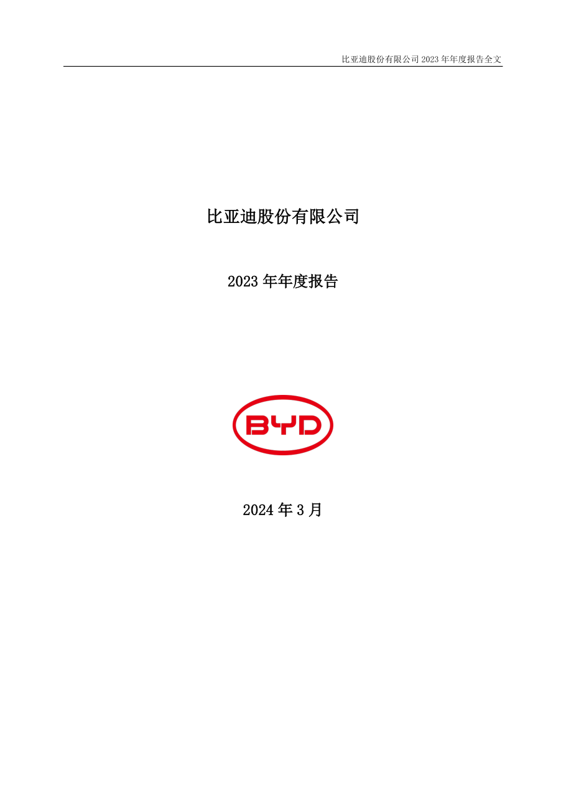
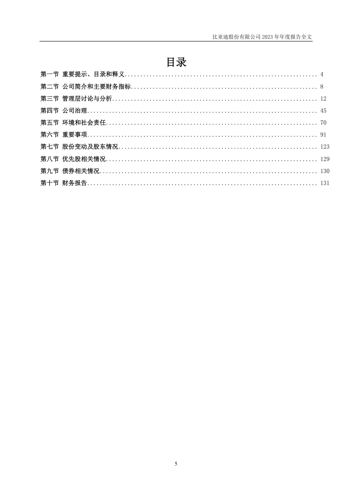
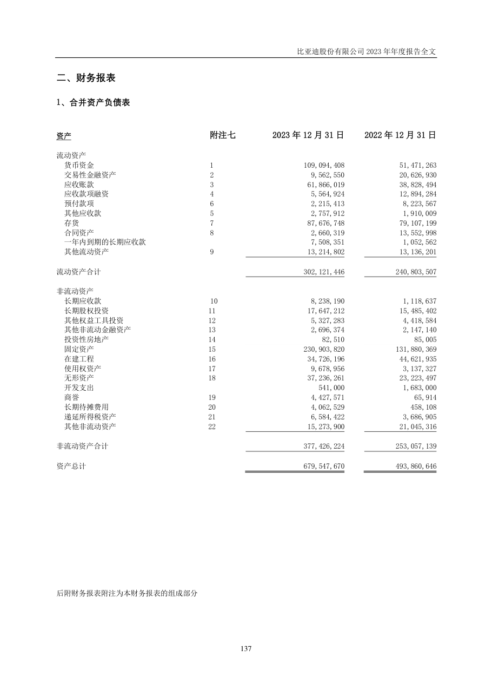
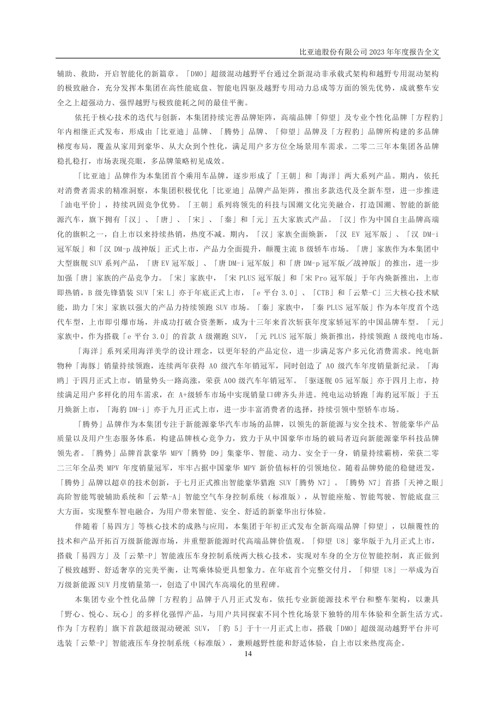
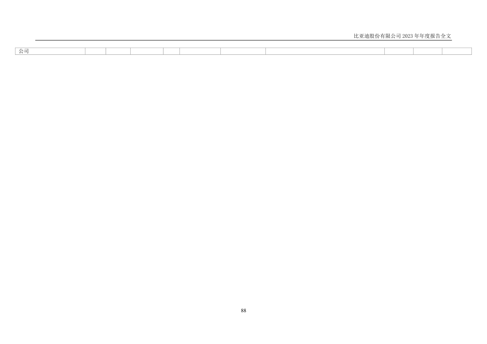
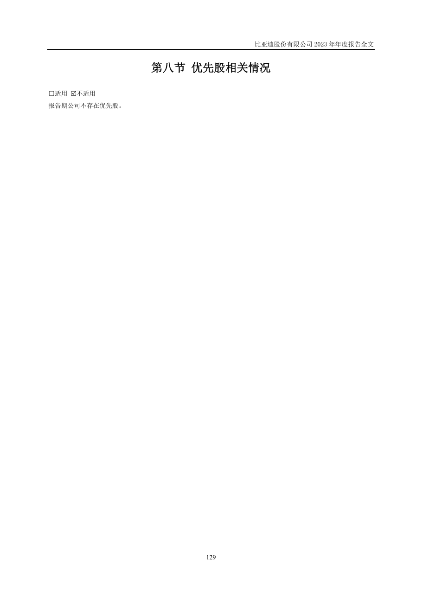
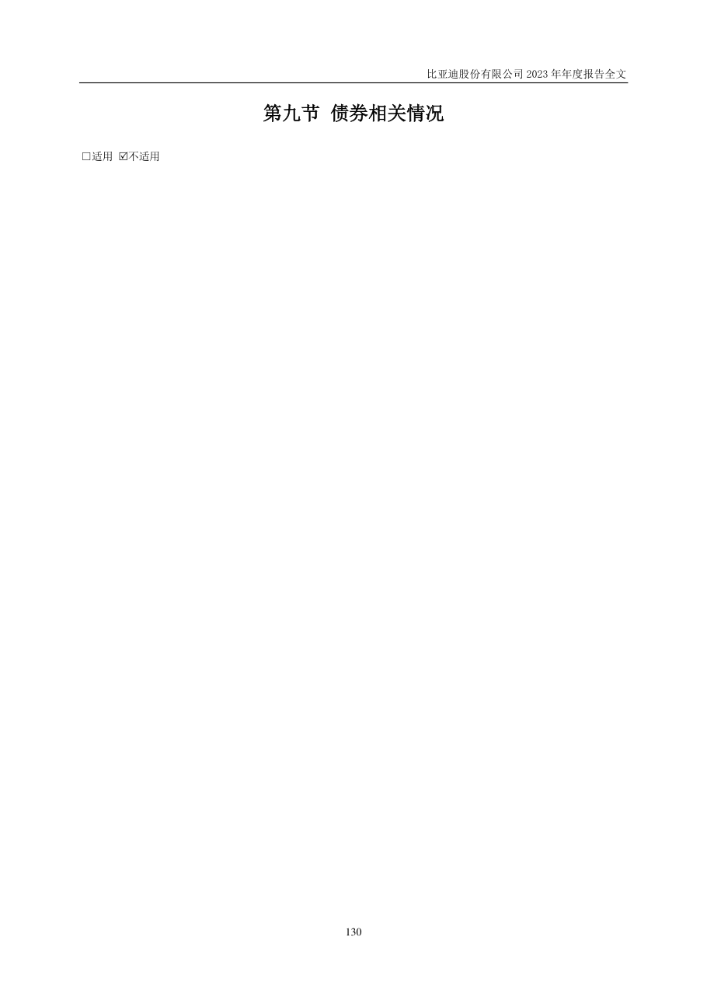
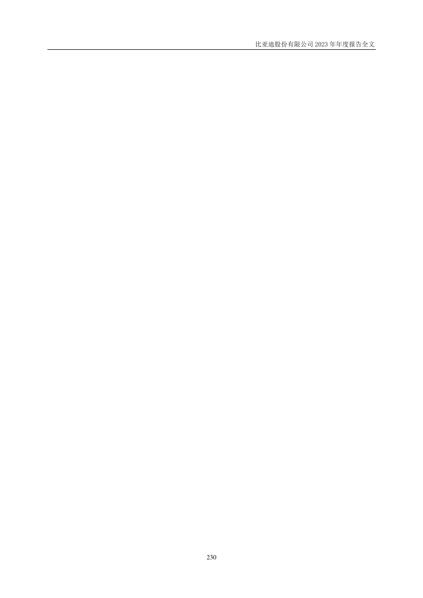
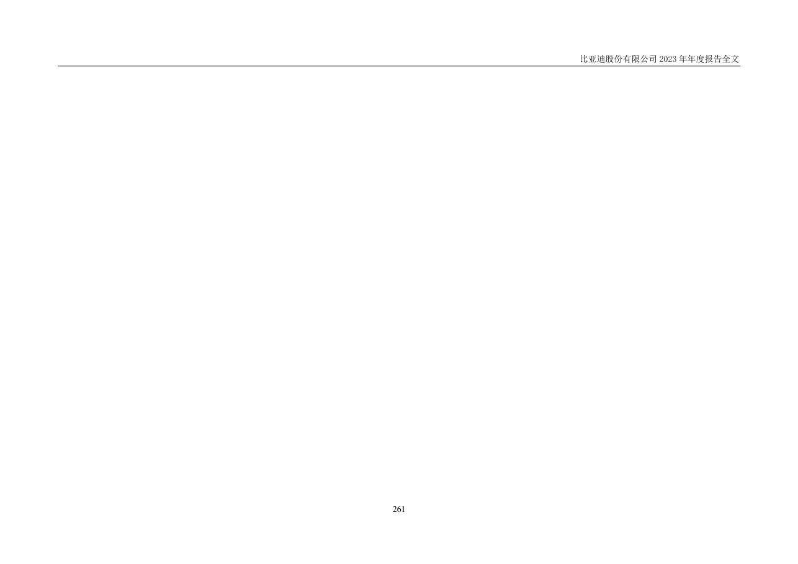
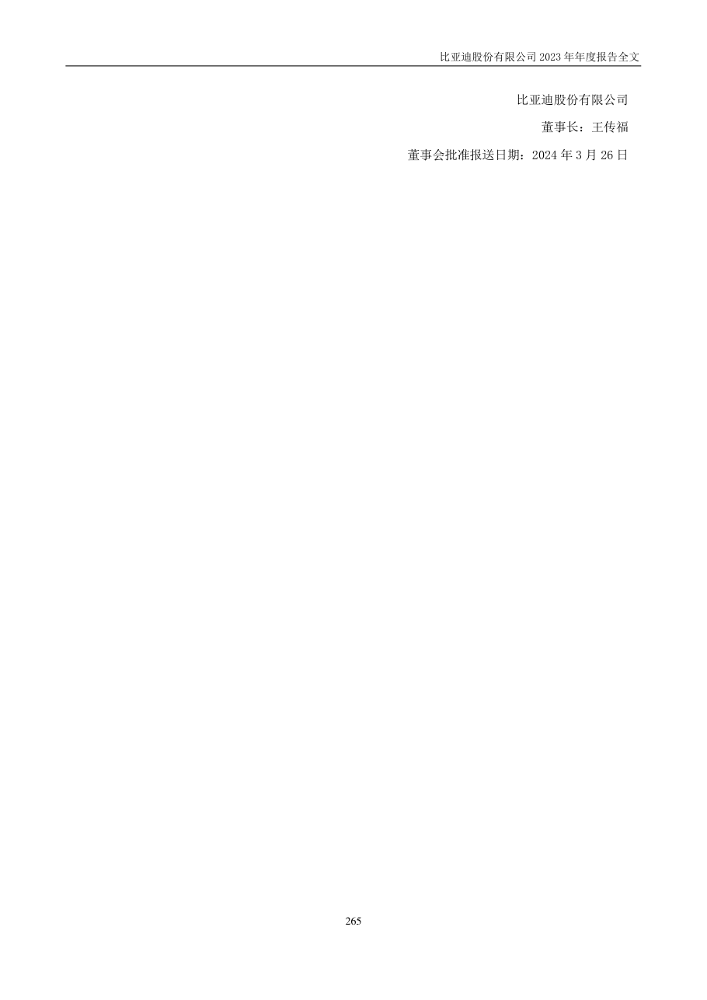

# 002594_2023 页面解析人工抽查

- 样本数：16
- 当前状态：待人工确认

## 验收清单

- [ ] 页面图像与提取文本属于同一PDF物理页
- [ ] 公司、报告年度和报告类型正确
- [ ] 目录章节与页码关系未明显错乱
- [ ] 正文阅读顺序基本正确且无大面积乱码
- [ ] 财务表格的项目、单位和关键数字可对应
- [ ] 异常页属于合理短页/封面/签署页，而非正文漏提取

## cover - PDF第1页

- 抽查原因：PDF封面与报告身份核验
- 印刷页码：None
- 章节：unknown
- 字符数：25
- 质量标记：['short_page']



### 提取文本

```text
比亚迪股份有限公司
2023 年年度报告
2024 年3 月
```

## table_of_contents - PDF第6页

- 抽查原因：目录与章节页码核验
- 印刷页码：5
- 章节：第一节 重要提示、目录和释义
- 字符数：805
- 质量标记：[]



### 提取文本

```text
目录
第一节 重要提示、目录和释义 .............................................................. 4
第二节 公司简介和主要财务指标 ............................................................ 8
第三节 管理层讨论与分析 .................................................................. 12
第四节 公司治理 .......................................................................... 45
第五节 环境和社会责任 .................................................................... 70
第六节 重要事项 .......................................................................... 91
第七节 股份变动及股东情况 ................................................................ 123
第八节 优先股相关情况 .................................................................... 129
第九节 债券相关情况 ...................................................................... 130
第十节 财务报告 .......................................................................... 131
5
```

## financial_table - PDF第138页

- 抽查原因：财务表格行列、数字和单位核验
- 印刷页码：137
- 章节：二、财务报表
- 字符数：764
- 质量标记：[]



### 提取文本

```text
二、财务报表
1、合并资产负债表
资产 附注七 2023 年12 月31 日 2022 年12 月31 日
流动资产
货币资金 1 109,094,408 51,471,263
交易性金融资产 2 9,562,550 20,626,930
应收账款 3 61,866,019 38,828,494
应收款项融资 4 5,564,924 12,894,284
预付款项 6 2,215,413 8,223,567
其他应收款 5 2,757,912 1,910,009
存货 7 87,676,748 79,107,199
合同资产 8 2,660,319 13,552,998
一年内到期的长期应收款 7,508,351 1,052,562
其他流动资产 9 13,214,802 13,136,201
流动资产合计 302,121,446 240,803,507
非流动资产
长期应收款 10 8,238,190 1,118,637
长期股权投资 11 17,647,212 15,485,402
其他权益工具投资 12 5,327,283 4,418,584
其他非流动金融资产 13 2,696,374 2,147,140
投资性房地产 14 82,510 85,005
固定资产 15 230,903,820 131,880,369
在建工程 16 34,726,196 44,621,935
使用权资产 17 9,678,956 3,137,327
无形资产 18 37,236,261 23,223,497
开发支出 541,000 1,683,000
商誉 19 4,427,571 65,914
长期待摊费用 20 4,062,529 458,108
递延所得税资产 21 6,584,422 3,686,905
其他非流动资产 22 15,273,900 21,045,316
非流动资产合计 377,426,224 253,057,139
资产总计 679,547,670 493,860,646
后附财务报表附注为本财务报表的组成部分
137
```

## body_text - PDF第15页

- 抽查原因：普通正文顺序与可读性核验
- 印刷页码：14
- 章节：第三节 管理层讨论与分析
- 字符数：1875
- 质量标记：[]



### 提取文本

```text
辅助、救助，开启智能化的新篇章。「DMO」超级混动越野平台通过全新混动非承载式架构和越野专用混动架构
的极致融合，充分发挥本集团在高性能底盘、智能电四驱及越野专用动力总成等方面的领先优势，成就整车安
全之上超强动力、强悍越野与极致能耗之间的最佳平衡。
依托于核心技术的迭代与创新，本集团持续完善品牌矩阵，高端品牌「仰望」及专业个性化品牌「方程豹」
年内相继正式发布，形成由「比亚迪」品牌、「腾势」品牌、「仰望」品牌及「方程豹」品牌所构建的多品牌
梯度布局，覆盖从家用到豪华、从大众到个性化，满足用户多方位全场景用车需求。二零二三年本集团各品牌
稳扎稳打，市场表现亮眼，多品牌策略初见成效。
「比亚迪」品牌作为本集团首个乘用车品牌，逐步形成了「王朝」和「海洋」两大系列产品。期内，依托
对消费者需求的精准洞察，本集团积极优化「比亚迪」品牌产品矩阵，推出多款迭代及全新车型，进一步推进
「油电平价」，持续巩固竞争优势。「王朝」系列将领先的科技与国潮文化完美融合，打造国潮、智能的新能
源汽车，旗下拥有「汉」、「唐」、「宋」、「秦」和「元」五大家族式产品。「汉」作为中国自主品牌高端
化的旗帜之一，自上市以来持续热销，热度不减。期内，「汉」家族全面焕新，「汉EV 冠军版」、「汉DM-i
冠军版」和「汉DM-p 战神版」正式上市，产品力全面提升，颠覆主流B 级轿车市场。「唐」家族作为本集团中
大型旗舰SUV 系列产品，「唐EV 冠军版」、「唐DM-i 冠军版」和「唐DM-p 冠军版╱战神版」的推出，进一步
加强「唐」家族的产品竞争力。「宋」家族中，「宋PLUS 冠军版」和「宋Pro 冠军版」于年内焕新推出，上市
即热销，B 级先锋猎装SUV「宋L」亦于年底正式上市，「e 平台3.0」、「CTB」和「云辇-C」三大核心技术赋
能，助力「宋」家族以强大的产品力持续领跑SUV 市场。「秦」家族中，「秦PLUS 冠军版」作为本年度首个迭
代车型，上市即引爆市场，并成功打破合资垄断，成为十三年来首次斩获年度家轿冠军的中国品牌车型。「元」
家族中，作为搭载「e 平台3.0」的首款A 级潮跑SUV，「元PLUS 冠军版」焕新推出，持续领跑A 级纯电市场。
「海洋」系列采用海洋美学的设计理念，以更年轻的产品定位，进一步满足客户多元化消费需求。纯电新
物种「海豚」销量持续领跑，连续两年获得A0 级汽车年销冠军，同时创造了A0 级汽车年度销量新纪录。「海
鸥」于四月正式上市，销量势头一路高涨，荣获A00 级汽车年销冠军。「驱逐舰05 冠军版」亦于四月上市，持
续满足用户多样化的用车需求，在A+级轿车市场中实现销量口碑齐头并进。纯电运动轿跑「海豹冠军版」于五
月焕新上市，「海豹DM-i」亦于九月正式上市，进一步丰富消费者的选择，持续引领中型轿车市场。
「腾势」品牌作为本集团专注于新能源豪华汽车市场的品牌，以领先的新能源与安全技术、智能豪华产品
质量以及用户生态服务体系，构建品牌核心竞争力，致力于从中国豪华市场的破局者迈向新能源豪华科技品牌
领先者。「腾势」品牌首款豪华MPV「腾势D9」集豪华、智能、动力、安全于一身，销量持续霸榜，荣获二零
二三年全品类MPV 年度销量冠军，牢牢占据中国豪华MPV 新价值标杆的引领地位。随着品牌势能的稳健迸发，
「腾势」品牌以超卓的技术创新，于七月正式推出智能豪华猎跑SUV「腾势N7」。「腾势N7」首搭「天神之眼」
高阶智能驾驶辅助系统和「云辇-A」智能空气车身控制系统（标准版），从智能座舱、智能驾驶、智能底盘三
大方面，实现整车智电融合，为用户带来智能、安全、舒适的新豪华出行体验。
伴随着「易四方」等核心技术的成熟与应用，本集团于年初正式发布全新高端品牌「仰望」，以颠覆性的
技术和产品开拓百万级新能源市场，并重塑新能源时代高端品牌价值观。「仰望U8」豪华版于九月正式上市，
搭载「易四方」及「云辇-P」智能液压车身控制系统两大核心技术，实现对车身的全方位智能控制，真正做到
了极致越野、舒适奢享的完美平衡，让驾乘体验更具想象力。在年底首个完整交付月，「仰望U8」一举成为百
万级新能源SUV 月度销量第一，创造了中国汽车高端化的里程碑。
本集团专业个性化品牌「方程豹」品牌于八月正式发布，依托专业新能源技术平台和整车架构，以兼具
「野心、悦心、玩心」的多样化强悍产品，与用户共同探索不同个性化场景下独特的用车体验和全新生活方式。
作为「方程豹」旗下首款超级混动硬派SUV，「豹5」于十一月正式上市，搭载「DMO」超级混动越野平台并可
选装「云辇-P」智能液压车身控制系统（标准版），兼顾越野性能和舒适体验，自上市以来热度高企。
14
```

## flagged_page - PDF第70页

- 抽查原因：异常页复核：short_page
- 印刷页码：69
- 章节：十三、公司报告期内对子公司的管理控制情况
- 字符数：2
- 质量标记：['short_page']


### 提取文本

```text
69
```

## flagged_page - PDF第89页

- 抽查原因：异常页复核：short_page
- 印刷页码：88
- 章节：一、三期工业
- 字符数：4
- 质量标记：['short_page']



### 提取文本

```text
公司
88
```

## flagged_page - PDF第130页

- 抽查原因：异常页复核：short_page
- 印刷页码：129
- 章节：第八节 优先股相关情况
- 字符数：32
- 质量标记：['short_page']



### 提取文本

```text
第八节 优先股相关情况
□适用 不适用
报告期公司不存在优先股。
129
```

## flagged_page - PDF第131页

- 抽查原因：异常页复核：short_page
- 印刷页码：130
- 章节：第九节 债券相关情况
- 字符数：19
- 质量标记：['short_page']



### 提取文本

```text
第九节 债券相关情况
□适用 不适用
130
```

## flagged_page - PDF第168页

- 抽查原因：异常页复核：short_page
- 印刷页码：167
- 章节：五、 重要会计政策及会计估计（续）
- 字符数：3
- 质量标记：['short_page']


### 提取文本

```text
167
```

## flagged_page - PDF第170页

- 抽查原因：异常页复核：short_page
- 印刷页码：169
- 章节：五、 重要会计政策及会计估计（续）
- 字符数：3
- 质量标记：['short_page']


### 提取文本

```text
169
```

## flagged_page - PDF第178页

- 抽查原因：异常页复核：short_page
- 印刷页码：177
- 章节：七、 合并财务报表主要项目注释
- 字符数：3
- 质量标记：['short_page']


### 提取文本

```text
177
```

## flagged_page - PDF第195页

- 抽查原因：异常页复核：short_page
- 印刷页码：194
- 章节：七、 合并财务报表主要项目注释（续）
- 字符数：3
- 质量标记：['short_page']


### 提取文本

```text
194
```

## flagged_page - PDF第231页

- 抽查原因：异常页复核：short_page
- 印刷页码：230
- 章节：十、 在其他主体中的权益（续）
- 字符数：3
- 质量标记：['short_page']



### 提取文本

```text
230
```

## flagged_page - PDF第238页

- 抽查原因：异常页复核：short_page
- 印刷页码：237
- 章节：十二、与金融工具相关的风险（续）
- 字符数：3
- 质量标记：['short_page']


### 提取文本

```text
237
```

## flagged_page - PDF第262页

- 抽查原因：异常页复核：short_page
- 印刷页码：261
- 章节：十九、公司财务报表主要项目注释（续）
- 字符数：3
- 质量标记：['short_page']



### 提取文本

```text
261
```

## flagged_page - PDF第266页

- 抽查原因：异常页复核：short_page
- 印刷页码：265
- 章节：二十、补充资料
- 字符数：39
- 质量标记：['short_page']



### 提取文本

```text
比亚迪股份有限公司
董事长：王传福
董事会批准报送日期：2024 年3 月26 日
265
```
