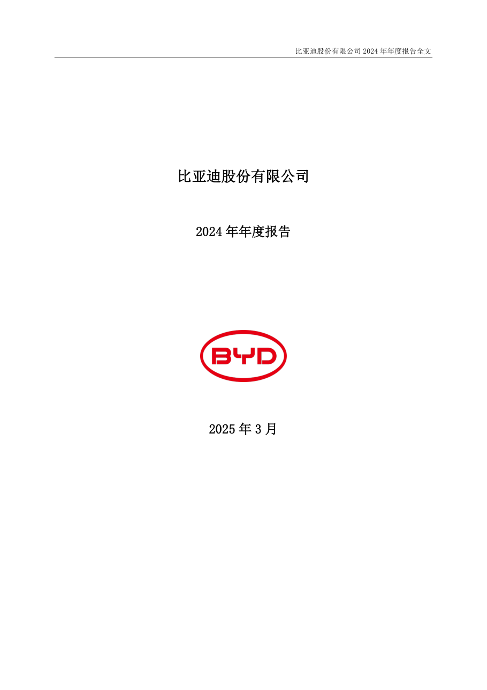
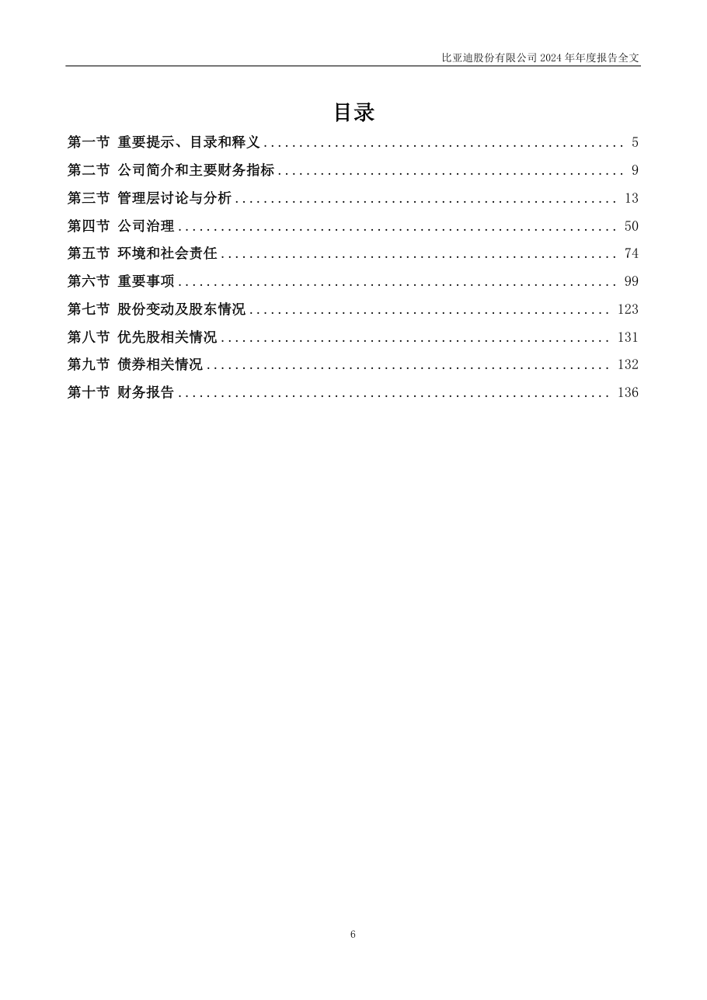
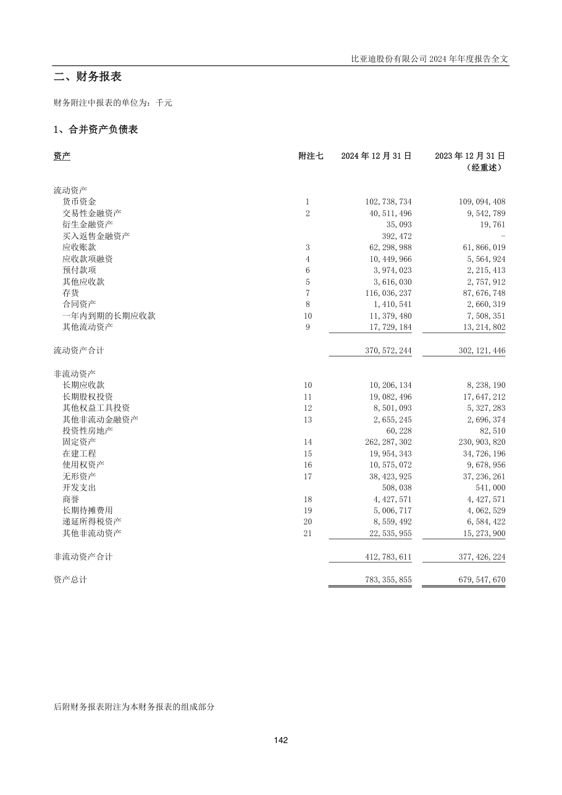
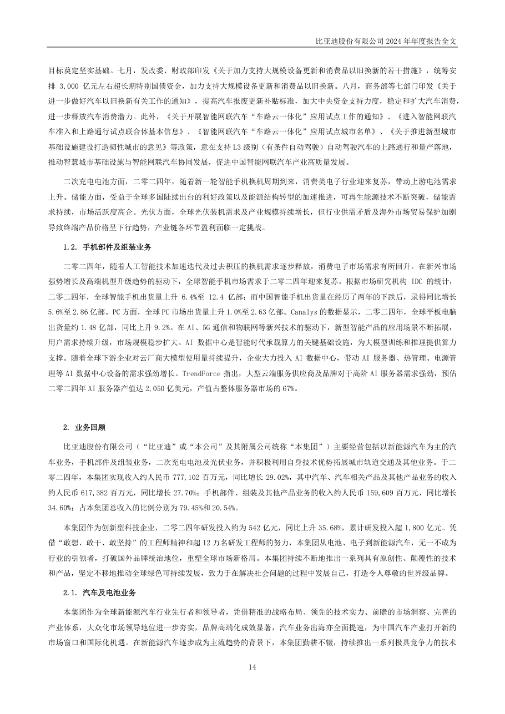
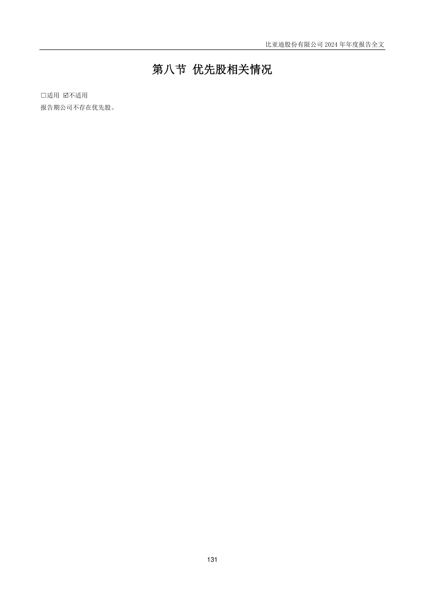
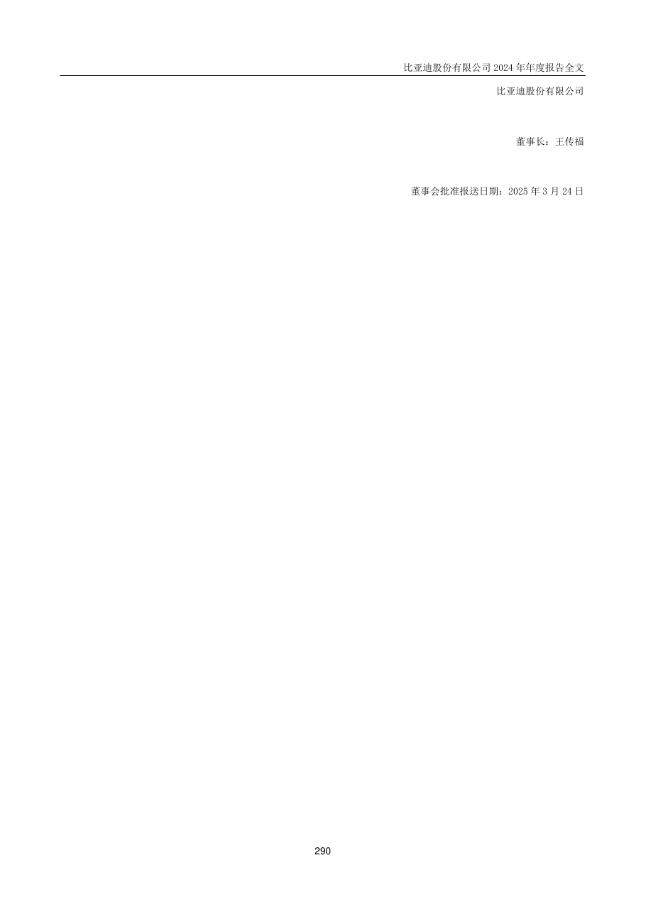

# 002594_2024 页面解析人工抽查

- 样本数：6
- 当前状态：已通过人工确认

## 验收清单

- [x] 页面图像与提取文本属于同一PDF物理页
- [x] 公司、报告年度和报告类型正确
- [x] 目录章节与页码关系未明显错乱
- [x] 正文阅读顺序基本正确且无大面积乱码
- [x] 财务表格的项目、单位和关键数字可对应
- [x] 异常页属于合理短页/封面/签署页，而非正文漏提取

## cover - PDF第1页

- 抽查原因：PDF封面与报告身份核验
- 印刷页码：None
- 章节：unknown
- 字符数：25
- 质量标记：['short_page']



### 提取文本

```text
比亚迪股份有限公司
2024 年年度报告
2025 年3 月
```

## table_of_contents - PDF第6页

- 抽查原因：目录与章节页码核验
- 印刷页码：6
- 章节：第一节 重要提示、目录和释义
- 字符数：683
- 质量标记：[]



### 提取文本

```text
目录
第一节 重要提示、目录和释义 ................................................... 5
第二节 公司简介和主要财务指标 ................................................. 9
第三节 管理层讨论与分析 ...................................................... 13
第四节 公司治理 .............................................................. 50
第五节 环境和社会责任 ........................................................ 74
第六节 重要事项 .............................................................. 99
第七节 股份变动及股东情况 ................................................... 123
第八节 优先股相关情况 ....................................................... 131
第九节 债券相关情况 ......................................................... 132
第十节 财务报告 ............................................................. 136
6
```

## financial_table - PDF第142页

- 抽查原因：财务表格行列、数字和单位核验
- 印刷页码：142
- 章节：二、财务报表
- 字符数：824
- 质量标记：[]



### 提取文本

```text
二、财务报表
财务附注中报表的单位为：千元
1、合并资产负债表
资产 附注七 2024 年12 月31 日 2023 年12 月31 日
（经重述）
流动资产
货币资金 1 102,738,734 109,094,408
交易性金融资产 2 40,511,496 9,542,789
衍生金融资产 35,093 19,761
买入返售金融资产 392,472 -
应收账款 3 62,298,988 61,866,019
应收款项融资 4 10,449,966 5,564,924
预付款项 6 3,974,023 2,215,413
其他应收款 5 3,616,030 2,757,912
存货 7 116,036,237 87,676,748
合同资产 8 1,410,541 2,660,319
一年内到期的长期应收款 10 11,379,480 7,508,351
其他流动资产 9 17,729,184 13,214,802
流动资产合计 370,572,244 302,121,446
非流动资产
长期应收款 10 10,206,134 8,238,190
长期股权投资 11 19,082,496 17,647,212
其他权益工具投资 12 8,501,093 5,327,283
其他非流动金融资产 13 2,655,245 2,696,374
投资性房地产 60,228 82,510
固定资产 14 262,287,302 230,903,820
在建工程 15 19,954,343 34,726,196
使用权资产 16 10,575,072 9,678,956
无形资产 17 38,423,925 37,236,261
开发支出 508,038 541,000
商誉 18 4,427,571 4,427,571
长期待摊费用 19 5,006,717 4,062,529
递延所得税资产 20 8,559,492 6,584,422
其他非流动资产 21 22,535,955 15,273,900
非流动资产合计 412,783,611 377,426,224
资产总计 783,355,855 679,547,670
后附财务报表附注为本财务报表的组成部分
142
```

## body_text - PDF第14页

- 抽查原因：普通正文顺序与可读性核验
- 印刷页码：14
- 章节：第三节 管理层讨论与分析
- 字符数：1701
- 质量标记：[]



### 提取文本

```text
目标奠定坚实基础。七月，发改委、财政部印发《关于加力支持大规模设备更新和消费品以旧换新的若干措施》，统筹安
排3,000 亿元左右超长期特别国债资金，加力支持大规模设备更新和消费品以旧换新。八月，商务部等七部门印发《关于
进一步做好汽车以旧换新有关工作的通知》，提高汽车报废更新补贴标准，加大中央资金支持力度，稳定和扩大汽车消费，
进一步释放汽车消费潜力。此外，《关于开展智能网联汽车“车路云一体化”应用试点工作的通知》、《进入智能网联汽
车准入和上路通行试点联合体基本信息》、《智能网联汽车“车路云一体化”应用试点城市名单》、《关于推进新型城市
基础设施建设打造韧性城市的意见》等政策，意在支持L3 级别（有条件自动驾驶）自动驾驶汽车的上路通行和量产落地，
推动智慧城市基础设施与智能网联汽车协同发展，促进中国智能网联汽车产业高质量发展。
二次充电电池方面，二零二四年，随着新一轮智能手机换机周期到来，消费类电子行业迎来复苏，带动上游电池需求
上升。储能方面，受益于全球多国陆续出台的利好政策以及能源结构转型的加速推进，可再生能源技术不断突破，储能需
求持续，市场活跃度高企。光伏方面，全球光伏装机需求及产业规模持续增长，但行业供需矛盾及海外市场贸易保护加剧
导致终端产品价格呈下行趋势，产业链各环节盈利面临一定挑战。
1.2. 手机部件及组装业务
二零二四年，随着人工智能技术加速迭代及过去积压的换机需求逐步释放，消费电子市场需求有所回升。在新兴市场
强势增长及高端机型升级趋势的驱动下，全球智能手机市场需求于二零二四年迎来复苏。根据市场研究机构IDC 的统计，
二零二四年，全球智能手机出货量上升6.4%至12.4 亿部；而中国智能手机出货量在经历了两年的下跌后，录得同比增长
5.6%至2.86 亿部。PC 方面，全球PC 市场出货量上升1.0%至2.63 亿部。Canalys 的数据显示，二零二四年，全球平板电脑
出货量约1.48 亿部，同比上升9.2%。在AI、5G 通信和物联网等新兴技术的驱动下，新型智能产品的应用场景不断拓展，
用户需求持续升级，市场规模稳步扩大。AI 数据中心是智能时代承载算力的关键基础设施，为大模型训练和推理提供算力
支撑。随着全球下游企业对云厂商大模型使用量持续提升，企业大力投入AI 数据中心，带动AI 服务器、热管理、电源管
理等AI 数据中心设备的需求强劲增长。TrendForce 指出，大型云端服务供应商及品牌对于高阶AI 服务器需求强劲，预估
二零二四年AI 服务器产值达2,050 亿美元，产值占整体服务器市场的67%。
2. 业务回顾
比亚迪股份有限公司（“比亚迪”或“本公司”及其附属公司统称“本集团”）主要经营包括以新能源汽车为主的汽
车业务，手机部件及组装业务，二次充电电池及光伏业务，并积极利用自身技术优势拓展城市轨道交通及其他业务。于二
零二四年，本集团实现收入约人民币777,102 百万元，同比增长29.02%，其中汽车、汽车相关产品及其他产品业务的收入
约人民币617,382 百万元，同比增长27.70%；手机部件、组装及其他产品业务的收入约人民币159,609 百万元，同比增长
34.60%；占本集团总收入的比例分别为79.45%和20.54%。
本集团作为创新型科技企业，二零二四年研发投入约为542 亿元，同比上升35.68%，累计研发投入超1,800 亿元。凭
借“敢想、敢干、敢坚持”的工程师精神和超12 万名研发工程师的努力，本集团从电池、电子到新能源汽车，无一不成为
行业的引领者，打破国外品牌统治地位，重塑全球市场新格局。本集团持续不断地推出一系列具有原创性、颠覆性的技术
和产品，坚定不移地推动全球绿色可持续发展，致力于在解决社会问题的过程中发展自己，打造令人尊敬的世界级品牌。
2.1. 汽车及电池业务
本集团作为全球新能源汽车行业先行者和领导者，凭借精准的战略布局、领先的技术实力、前瞻的市场洞察、完善的
产业体系，大众化市场领导地位进一步夯实，品牌高端化成效显著，汽车业务出海亦全面提速，为中国汽车产业打开新的
市场窗口和国际化机遇。在新能源汽车逐步成为主流趋势的背景下，本集团勤耕不辍，持续推出一系列极具竞争力的技术
14
```

## flagged_page - PDF第131页

- 抽查原因：异常页复核：short_page
- 印刷页码：131
- 章节：第八节 优先股相关情况
- 字符数：32
- 质量标记：['short_page']



### 提取文本

```text
第八节 优先股相关情况
□适用 不适用
报告期公司不存在优先股。
131
```

## flagged_page - PDF第290页

- 抽查原因：异常页复核：short_page
- 印刷页码：290
- 章节：二十、补充资料(续)
- 字符数：39
- 质量标记：['short_page']



### 提取文本

```text
比亚迪股份有限公司
董事长：王传福
董事会批准报送日期：2025 年3 月24 日
290
```
