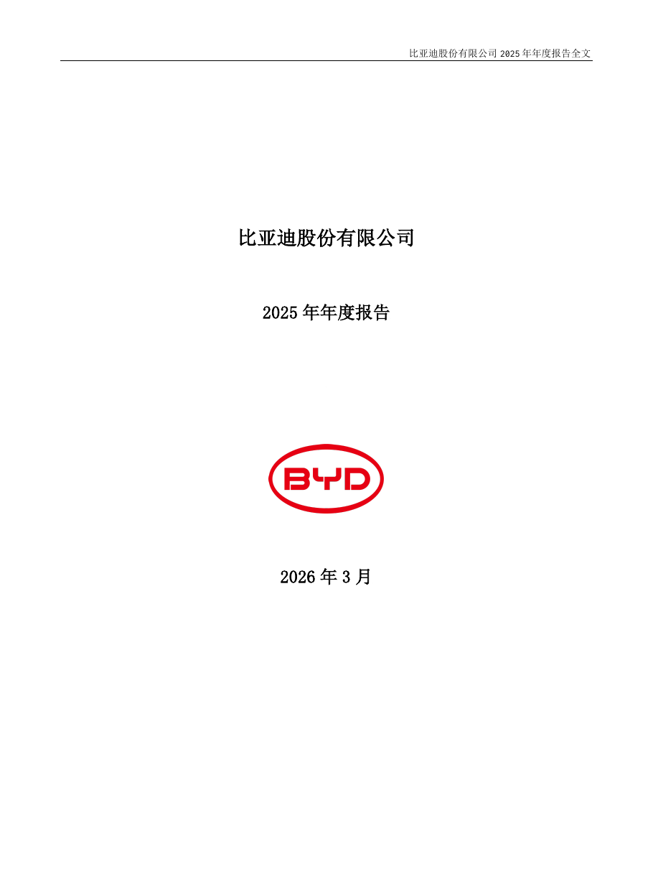
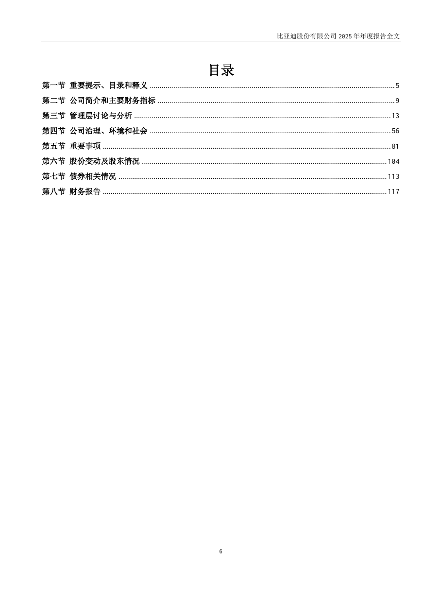
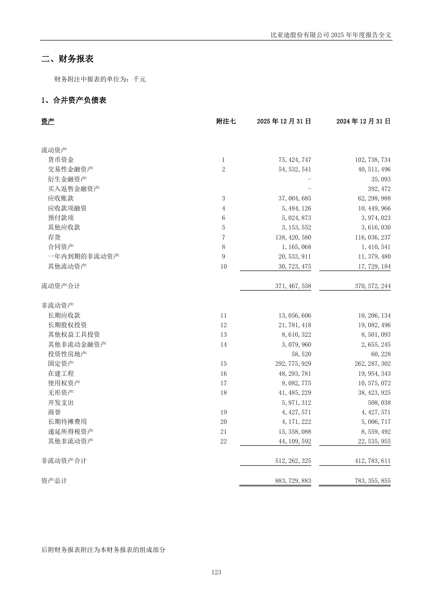
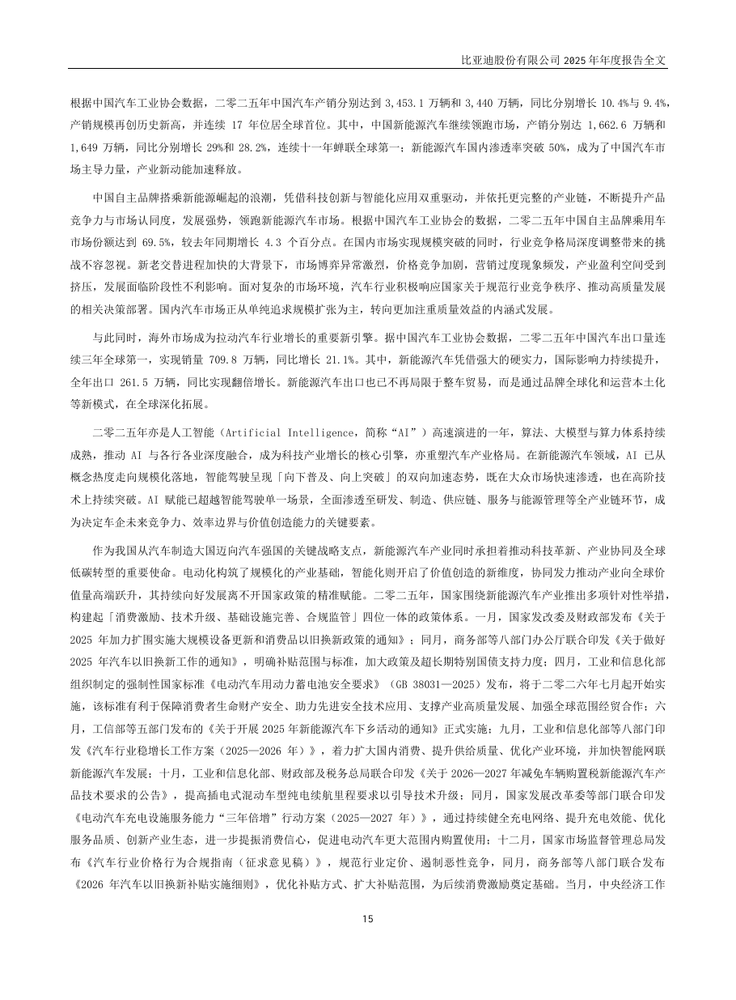
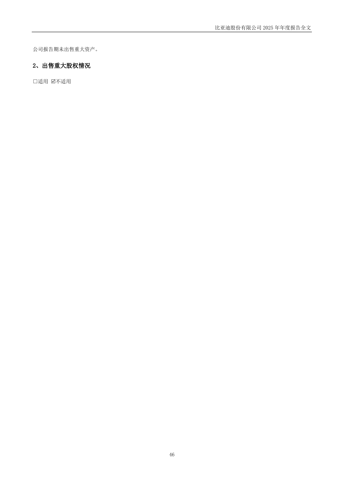
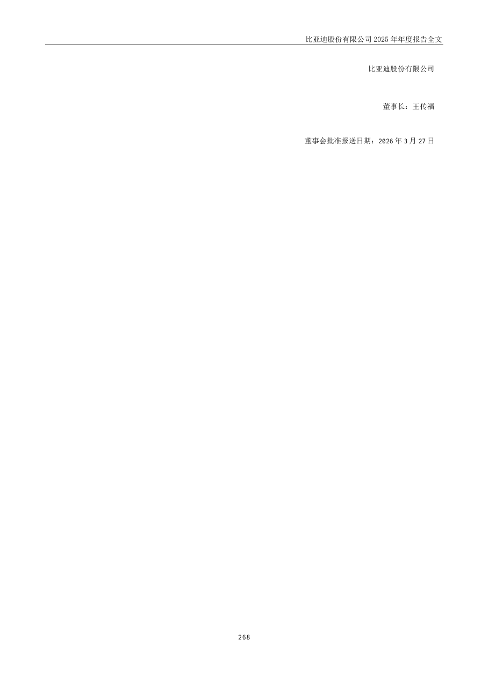

# 002594_2025 页面解析人工抽查

- 样本数：6
- 当前状态：待人工确认

## 验收清单

- [ ] 页面图像与提取文本属于同一PDF物理页
- [ ] 公司、报告年度和报告类型正确
- [ ] 目录章节与页码关系未明显错乱
- [ ] 正文阅读顺序基本正确且无大面积乱码
- [ ] 财务表格的项目、单位和关键数字可对应
- [ ] 异常页属于合理短页/封面/签署页，而非正文漏提取

## cover - PDF第1页

- 抽查原因：PDF封面与报告身份核验
- 印刷页码：None
- 章节：unknown
- 字符数：25
- 质量标记：['short_page']



### 提取文本

```text
比亚迪股份有限公司
2025 年年度报告
2026 年3 月
```

## table_of_contents - PDF第6页

- 抽查原因：目录与章节页码核验
- 印刷页码：6
- 章节：第一节 重要提示、目录和释义
- 字符数：1160
- 质量标记：[]



### 提取文本

```text
目录
第一节 重要提示、目录和释义 ............................................................................................................................. 5
第二节 公司简介和主要财务指标 ......................................................................................................................... 9
第三节 管理层讨论与分析 ................................................................................................................................... 13
第四节 公司治理、环境和社会 ........................................................................................................................... 56
第五节 重要事项 ................................................................................................................................................... 81
第六节 股份变动及股东情况 ............................................................................................................................. 104
第七节 债券相关情况 ......................................................................................................................................... 113
第八节 财务报告 ................................................................................................................................................. 117
6
```

## financial_table - PDF第123页

- 抽查原因：财务表格行列、数字和单位核验
- 印刷页码：123
- 章节：二、财务报表
- 字符数：820
- 质量标记：[]



### 提取文本

```text
二、财务报表
财务附注中报表的单位为：千元
1、合并资产负债表
资产 附注七 2025 年12 月31 日 2024 年12 月31 日
流动资产
货币资金 1 75,424,747 102,738,734
交易性金融资产 2 54,532,541 40,511,496
衍生金融资产 - 35,093
买入返售金融资产 - 392,472
应收账款 3 37,004,685 62,298,988
应收款项融资 4 5,484,126 10,449,966
预付款项 6 5,024,873 3,974,023
其他应收款 5 3,153,552 3,616,030
存货 7 138,420,580 116,036,237
合同资产 8 1,165,068 1,410,541
一年内到期的非流动资产 9 20,533,911 11,379,480
其他流动资产 10 30,723,475 17,729,184
流动资产合计 371,467,558 370,572,244
非流动资产
长期应收款 11 13,056,606 10,206,134
长期股权投资 12 21,781,418 19,082,496
其他权益工具投资 13 8,610,322 8,501,093
其他非流动金融资产 14 3,079,960 2,655,245
投资性房地产 58,520 60,228
固定资产 15 292,775,929 262,287,302
在建工程 16 48,293,781 19,954,343
使用权资产 17 9,082,775 10,575,072
无形资产 18 41,485,229 38,423,925
开发支出 5,971,312 508,038
商誉 19 4,427,571 4,427,571
长期待摊费用 20 4,171,222 5,006,717
递延所得税资产 21 15,358,088 8,559,492
其他非流动资产 22 44,109,592 22,535,955
非流动资产合计 512,262,325 412,783,611
资产总计 883,729,883 783,355,855
后附财务报表附注为本财务报表的组成部分
123
```

## body_text - PDF第15页

- 抽查原因：普通正文顺序与可读性核验
- 印刷页码：15
- 章节：第三节 管理层讨论与分析
- 字符数：1804
- 质量标记：[]



### 提取文本

```text
根据中国汽车工业协会数据，二零二五年中国汽车产销分别达到3,453.1 万辆和3,440 万辆，同比分别增长10.4%与9.4%，
产销规模再创历史新高，并连续17 年位居全球首位。其中，中国新能源汽车继续领跑市场，产销分别达1,662.6 万辆和
1,649 万辆，同比分别增长29%和28.2%，连续十一年蝉联全球第一；新能源汽车国内渗透率突破50%，成为了中国汽车市
场主导力量，产业新动能加速释放。
中国自主品牌搭乘新能源崛起的浪潮，凭借科技创新与智能化应用双重驱动，并依托更完整的产业链，不断提升产品
竞争力与市场认同度，发展强势，领跑新能源汽车市场。根据中国汽车工业协会的数据，二零二五年中国自主品牌乘用车
市场份额达到69.5%，较去年同期增长4.3 个百分点。在国内市场实现规模突破的同时，行业竞争格局深度调整带来的挑
战不容忽视。新老交替进程加快的大背景下，市场博弈异常激烈，价格竞争加剧，营销过度现象频发，产业盈利空间受到
挤压，发展面临阶段性不利影响。面对复杂的市场环境，汽车行业积极响应国家关于规范行业竞争秩序、推动高质量发展
的相关决策部署。国内汽车市场正从单纯追求规模扩张为主，转向更加注重质量效益的内涵式发展。
与此同时，海外市场成为拉动汽车行业增长的重要新引擎。据中国汽车工业协会数据，二零二五年中国汽车出口量连
续三年全球第一，实现销量709.8 万辆，同比增长21.1%。其中，新能源汽车凭借强大的硬实力，国际影响力持续提升，
全年出口261.5 万辆，同比实现翻倍增长。新能源汽车出口也已不再局限于整车贸易，而是通过品牌全球化和运营本土化
等新模式，在全球深化拓展。
二零二五年亦是人工智能（Artificial Intelligence，简称“AI”）高速演进的一年，算法、大模型与算力体系持续
成熟，推动AI 与各行各业深度融合，成为科技产业增长的核心引擎，亦重塑汽车产业格局。在新能源汽车领域，AI 已从
概念热度走向规模化落地，智能驾驶呈现「向下普及、向上突破」的双向加速态势，既在大众市场快速渗透，也在高阶技
术上持续突破。AI 赋能已超越智能驾驶单一场景，全面渗透至研发、制造、供应链、服务与能源管理等全产业链环节，成
为决定车企未来竞争力、效率边界与价值创造能力的关键要素。
作为我国从汽车制造大国迈向汽车强国的关键战略支点，新能源汽车产业同时承担着推动科技革新、产业协同及全球
低碳转型的重要使命。电动化构筑了规模化的产业基础，智能化则开启了价值创造的新维度，协同发力推动产业向全球价
值量高端跃升，其持续向好发展离不开国家政策的精准赋能。二零二五年，国家围绕新能源汽车产业推出多项针对性举措，
构建起「消费激励、技术升级、基础设施完善、合规监管」四位一体的政策体系。一月，国家发改委及财政部发布《关于
2025 年加力扩围实施大规模设备更新和消费品以旧换新政策的通知》；同月，商务部等八部门办公厅联合印发《关于做好
2025 年汽车以旧换新工作的通知》，明确补贴范围与标准，加大政策及超长期特别国债支持力度；四月，工业和信息化部
组织制定的强制性国家标准《电动汽车用动力蓄电池安全要求》（GB 38031—2025）发布，将于二零二六年七月起开始实
施，该标准有利于保障消费者生命财产安全、助力先进安全技术应用、支撑产业高质量发展、加强全球范围经贸合作；六
月，工信部等五部门发布的《关于开展2025 年新能源汽车下乡活动的通知》正式实施；九月，工业和信息化部等八部门印
发《汽车行业稳增长工作方案（2025—2026 年）》，着力扩大国内消费、提升供给质量、优化产业环境，并加快智能网联
新能源汽车发展；十月，工业和信息化部、财政部及税务总局联合印发《关于2026—2027 年减免车辆购置税新能源汽车产
品技术要求的公告》，提高插电式混动车型纯电续航里程要求以引导技术升级；同月，国家发展改革委等部门联合印发
《电动汽车充电设施服务能力“三年倍增”行动方案（2025—2027 年）》，通过持续健全充电网络、提升充电效能、优化
服务品质、创新产业生态，进一步提振消费信心，促进电动汽车更大范围内购置使用；十二月，国家市场监督管理总局发
布《汽车行业价格行为合规指南（征求意见稿）》，规范行业定价、遏制恶性竞争，同月，商务部等八部门联合发布
《2026 年汽车以旧换新补贴实施细则》，优化补贴方式、扩大补贴范围，为后续消费激励奠定基础。当月，中央经济工作
15
```

## flagged_page - PDF第46页

- 抽查原因：异常页复核：short_page
- 印刷页码：46
- 章节：七、投资状况分析
- 字符数：32
- 质量标记：['short_page']



### 提取文本

```text
公司报告期未出售重大资产。
2、出售重大股权情况
□适用 不适用
46
```

## flagged_page - PDF第268页

- 抽查原因：异常页复核：short_page
- 印刷页码：268
- 章节：二十、补充资料
- 字符数：39
- 质量标记：['short_page']



### 提取文本

```text
比亚迪股份有限公司
董事长：王传福
董事会批准报送日期：2026 年3 月27 日
268
```
