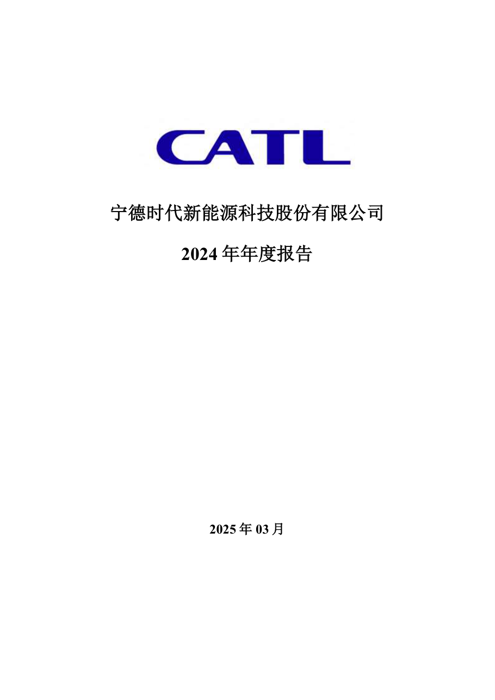
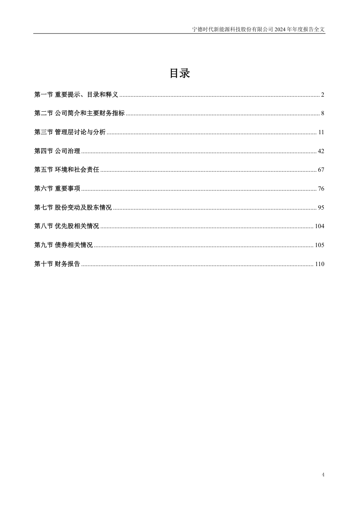
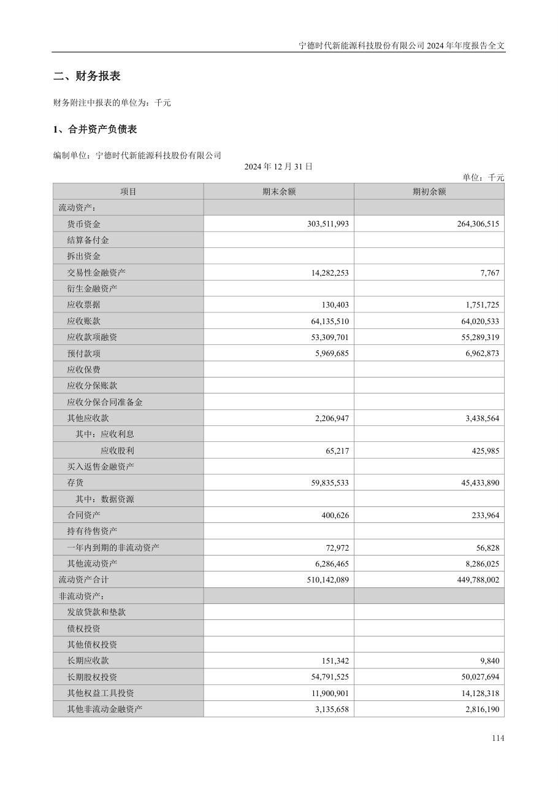
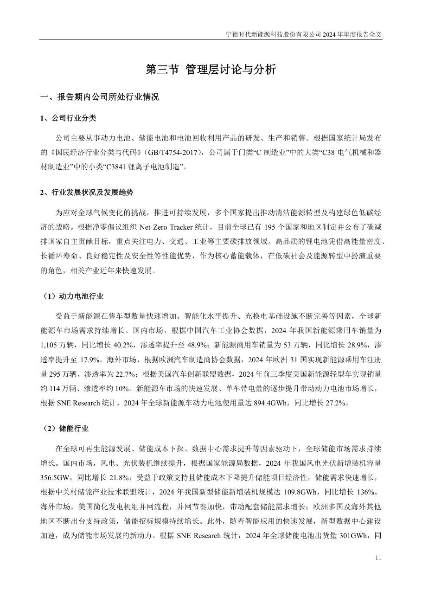

# 300750_2024 页面解析人工抽查

- 样本数：6
- 当前状态：待人工确认

## 验收清单

- [ ] 页面图像与提取文本属于同一PDF物理页
- [ ] 公司、报告年度和报告类型正确
- [ ] 目录章节与页码关系未明显错乱
- [ ] 正文阅读顺序基本正确且无大面积乱码
- [ ] 财务表格的项目、单位和关键数字可对应
- [ ] 异常页属于合理短页/封面/签署页，而非正文漏提取

## cover - PDF第1页

- 抽查原因：PDF封面与报告身份核验
- 印刷页码：None
- 章节：unknown
- 字符数：32
- 质量标记：['short_page']



### 提取文本

```text
宁德时代新能源科技股份有限公司
2024 年年度报告
2025 年03 月
```

## table_of_contents - PDF第4页

- 抽查原因：目录与章节页码核验
- 印刷页码：4
- 章节：八、董事会审议的报告期利润分配预案或公积金转增股本预案
- 字符数：1482
- 质量标记：[]



### 提取文本

```text
目录
第一节 重要提示、目录和释义 .............................................................................................................................. 2
第二节 公司简介和主要财务指标 .......................................................................................................................... 8
第三节 管理层讨论与分析 .................................................................................................................................... 11
第四节 公司治理 .................................................................................................................................................... 42
第五节 环境和社会责任 ........................................................................................................................................ 67
第六节 重要事项 .................................................................................................................................................... 76
第七节 股份变动及股东情况 ................................................................................................................................ 95
第八节 优先股相关情况 ...................................................................................................................................... 104
第九节 债券相关情况 .......................................................................................................................................... 105
第十节 财务报告 .................................................................................................................................................. 110
4
```

## financial_table - PDF第114页

- 抽查原因：财务表格行列、数字和单位核验
- 印刷页码：114
- 章节：二、财务报表
- 字符数：561
- 质量标记：[]



### 提取文本

```text
二、财务报表
财务附注中报表的单位为：千元
1、合并资产负债表
编制单位：宁德时代新能源科技股份有限公司
2024 年12 月31 日
单位：千元
项目 期末余额 期初余额
流动资产：
货币资金 303,511,993 264,306,515
结算备付金
拆出资金
交易性金融资产 14,282,253 7,767
衍生金融资产
应收票据 130,403 1,751,725
应收账款 64,135,510 64,020,533
应收款项融资 53,309,701 55,289,319
预付款项 5,969,685 6,962,873
应收保费
应收分保账款
应收分保合同准备金
其他应收款 2,206,947 3,438,564
其中：应收利息
应收股利 65,217 425,985
买入返售金融资产
存货 59,835,533 45,433,890
其中：数据资源
合同资产 400,626 233,964
持有待售资产
一年内到期的非流动资产 72,972 56,828
其他流动资产 6,286,465 8,286,025
流动资产合计 510,142,089 449,788,002
非流动资产：
发放贷款和垫款
债权投资
其他债权投资
长期应收款 151,342 9,840
长期股权投资 54,791,525 50,027,694
其他权益工具投资 11,900,901 14,128,318
其他非流动金融资产 3,135,658 2,816,190
114
```

## body_text - PDF第11页

- 抽查原因：普通正文顺序与可读性核验
- 印刷页码：11
- 章节：第三节 管理层讨论与分析
- 字符数：1074
- 质量标记：[]



### 提取文本

```text
第三节 管理层讨论与分析
一、报告期内公司所处行业情况
1、公司行业分类
公司主要从事动力电池、储能电池和电池回收利用产品的研发、生产和销售。根据国家统计局发布
的《国民经济行业分类与代码》（GB/T4754-2017），公司属于门类“C 制造业”中的大类“C38 电气机械和器
材制造业”中的小类“C3841 锂离子电池制造”。
2、行业发展状况及发展趋势
为应对全球气候变化的挑战，推进可持续发展，多个国家提出推动清洁能源转型及构建绿色低碳经
济的战略。根据净零倡议组织Net Zero Tracker 统计，目前全球已有195 个国家和地区制定并公布了碳减
排国家自主贡献目标，重点关注电力、交通、工业等主要碳排放领域。高品质的锂电池凭借高能量密度、
长循环寿命、良好稳定性及安全性等性能优势，作为核心蓄能载体，在低碳社会及能源转型中扮演重要
的角色，相关产业近年来快速发展。
（1）动力电池行业
受益于新能源在售车型数量快速增加、智能化水平提升、充换电基础设施不断完善等因素，全球新
能源车市场需求持续增长。国内市场，根据中国汽车工业协会数据，2024 年我国新能源乘用车销量为
1,105 万辆，同比增长40.2%，渗透率提升至48.9%；新能源商用车销量为53 万辆，同比增长28.9%，渗
透率提升至17.9%。海外市场，根据欧洲汽车制造商协会数据，2024 年欧洲31 国实现新能源乘用车注册
量295 万辆、渗透率为22.7%；根据美国汽车创新联盟数据，2024 年前三季度美国新能源轻型车实现销量
约114 万辆、渗透率约10%。新能源车市场的快速发展、单车带电量的逐步提升带动动力电池市场增长，
根据SNE Research 统计，2024 年全球新能源车动力电池使用量达894.4GWh，同比增长27.2%。
（2）储能行业
在全球可再生能源发展、储能成本下探、数据中心需求提升等因素驱动下，全球储能市场需求持续
增长。国内市场，风电、光伏装机继续提升，根据国家能源局数据，2024 年我国风电光伏新增装机容量
356.5GW，同比增长21.8%；受益于政策支持且储能成本下降提升储能项目经济性，储能需求快速增长，
根据中关村储能产业技术联盟统计，2024 年我国新型储能新增装机规模达109.8GWh，同比增长136%。
海外市场，美国简化发电机组并网流程，并网节奏加快，带动配套储能需求增长；欧洲多国及海外其他
地区不断出台支持政策，储能招标规模持续增长。此外，随着智能应用的快速发展，新型数据中心建设
加速，成为储能市场发展的新动力。根据SNE Research 统计，2024 年全球储能电池出货量301GWh，同
11
```

## flagged_page - PDF第66页

- 抽查原因：异常页复核：short_page
- 印刷页码：66
- 章节：十七、上市公司治理专项行动自查问题整改情况
- 字符数：30
- 质量标记：['short_page']


### 提取文本

```text
十七、上市公司治理专项行动自查问题整改情况
□适用 不适用
66
```

## flagged_page - PDF第104页

- 抽查原因：异常页复核：short_page
- 印刷页码：104
- 章节：第八节 优先股相关情况
- 字符数：32
- 质量标记：['short_page']


### 提取文本

```text
第八节 优先股相关情况
□适用 不适用
报告期公司不存在优先股。
104
```
